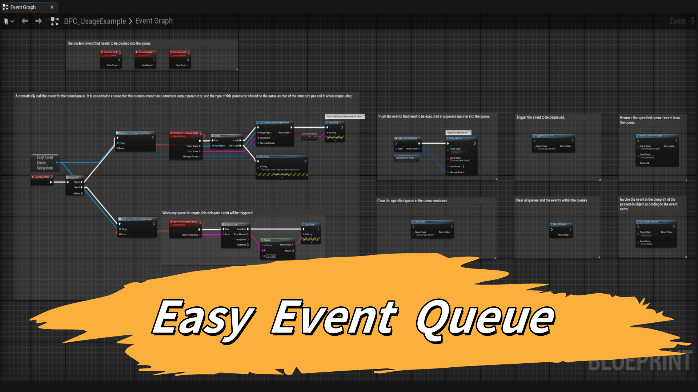

# EasyEventQueue
# Easy Event Queue Plugins

## 1. After downloading from the Fab Market, search for "Easy Event Queue" in your UE plugin, check it, and then restart the UE.

## 2. Find "BPC_UsageExample" in the plugin directory "Easy Event Queue Content", which contains examples of all nodes.

